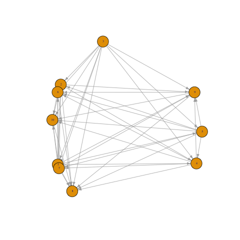

# partitionDAG

partitionDAG estimates the adjacency matrix for a DAG where  partial ordering of the nodes is known. Please note that you must install pdagDFS as well.

## Installation

```
install.packages("devtools")
library(devtools)
install_github("shr264/partitionDAG")
```
## Example

The following code

```
library(partitionDAG)
library(igraph)
n = 20
p = 10
X = generate_data(n,p)
B = partitionDAG::partial2(X,l = 0.001, m1 = floor(p/2))$B
colnames(B) = 1:p
row.names(B) = 1:p
graphB = graph_from_adjacency_matrix(t(B), mode = 'directed', weighted = TRUE, diag = FALSE)
plot(graphB, vertex.size=15, vertex.label.dist = .1,
vertex.label.cex = 0.5, edge.arrow.size = 0.5)
```
produces


